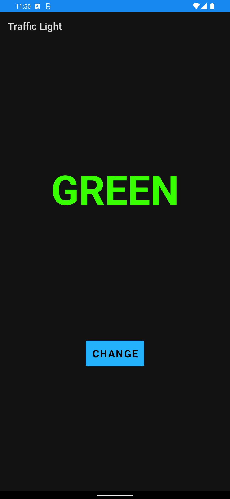

<div align = "center">

<h1><a href="https://2kabhishek.github.io/TrafficLight">Traffic Light</a></h1>

<a href="https://github.com/2KAbhishek/TrafficLight/blob/main/LICENSE">
 </a>

<a href="https://github.com/2KAbhishek/TrafficLight/pulse">
 </a>

<a href="https://github.com/2KAbhishek/TrafficLight/stargazers">
</a>

<a href="https://github.com/2KAbhishek/TrafficLight/network/members">
 </a>

<a href="https://github.com/2KAbhishek/TrafficLight/watchers">
 </a>

<a href="https://github.com/2KAbhishek/TrafficLight/graphs/contributors">
 </a>

<a href="https://github.com/2KAbhishek?tab=followers">
 </a>

<h3>Colurs and Buttons 🔘🚦</h3>

<figure>
  
  <br/>
  <figcaption>TrafficLight screenshot</figcaption>
</figure>

</div>

## What is this

TrafficLight is an Android app that demonstrates the use of multiple fragments and communicating between them with listener interfaces.

## Inspiration

Wanted to explore Fragments on Android.

## Prerequisites

Before you begin, ensure you have met the following requirements:

- You have installed the latest version of `Android Studio`

## Getting TrafficLight

To get TrafficLight, follow these steps:

```bash
git clone https://github.com/2kabhishek/TrafficLight
cd TrafficLight
```

## What I learned

- Learned more about Fragments
- Learned about Listener interfaces


Hit the ⭐ button if you found this useful.

## More Info

<div align="center">

<a href="https://github.com/2KAbhishek/TrafficLight">Source</a> | <a href="https://2kabhishek.github.io/TrafficLight">Website</a>

</div>
